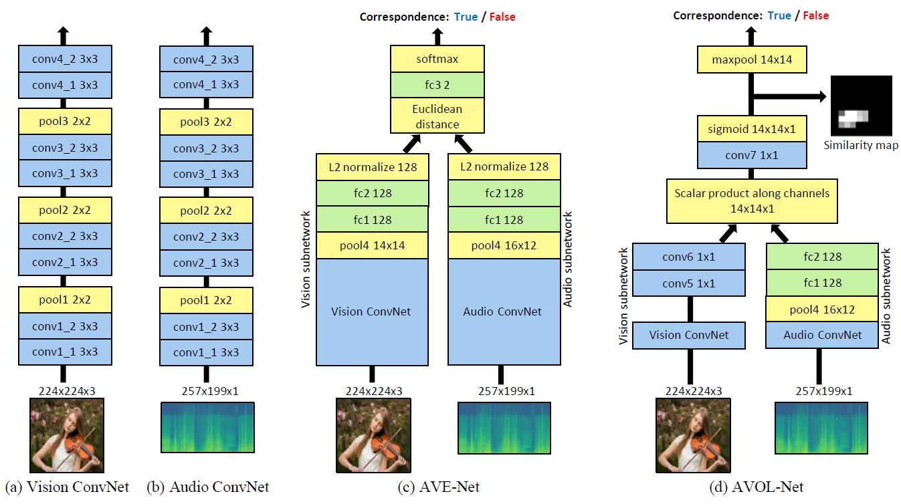
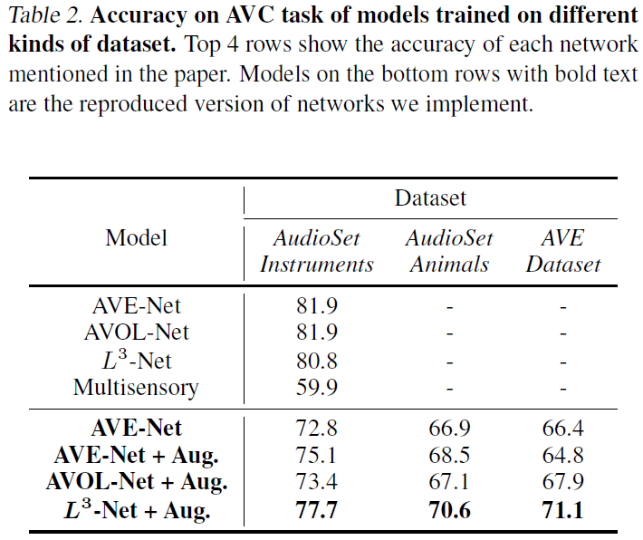
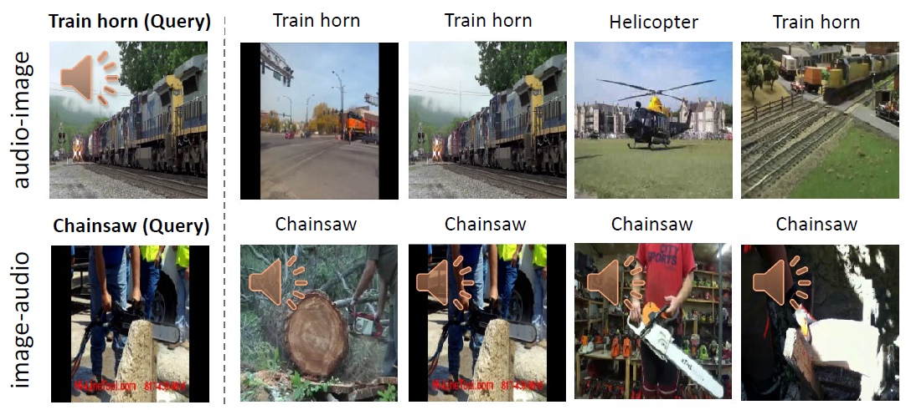
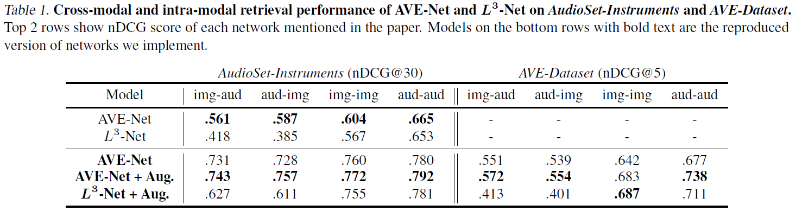
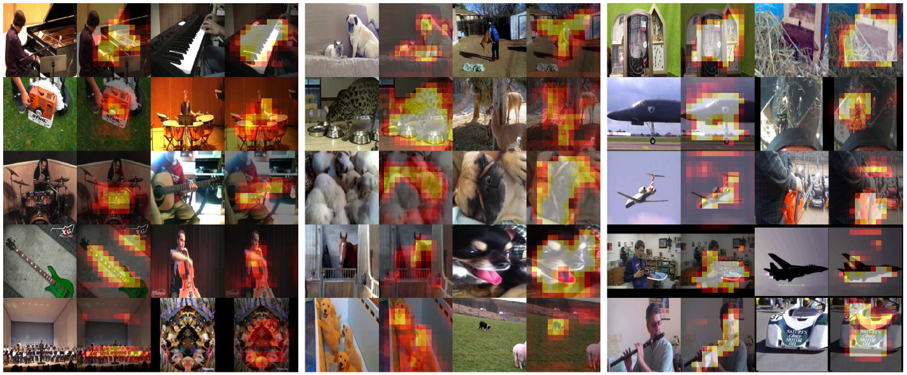

## Objects that Sound
The repository includes unofficial but **full reproduction** of the paper [**"Objects that Sound"**](https://arxiv.org/pdf/1712.06651.pdf) from ECCV 2018. :blush:

### Environment
We implement this work in **PyTorch** with **Python 3.6**, and we strongly recommend to use **Ubuntu 16.04**.

It took about less than 20 hours to train the models on 48,000 videos, with **Intel i7-9700k** and **RTX 2080 Ti**.

For detailed package requirements, please refer to `requirements.txt` for more information.

### Model

We implement **AVE-Net**, **AVOL-Net**, and also **L3-Net** which is one of the baseline models.

### Dataset
We use or construct **3 different dataset** to train and evaluate the models.
- **AudioSet-Instruments:**
- **AudioSet-Animal** 
- **AVE-Dataset**
Due to the resource limitation, we use 20% subset of **AudioSet-Instruments** suggested in the paper.

Please refer to [**Final Report**](material/CS570_Final_Report_Team7.pdf) for more detailed explanations about each dataset.

### Results

We note that our results are quite different from the paper.

We expect this difference may come from difference in size of the dataset, batch size, learning rate, or any other subtle difference in training configurations.

### 1. Accuracy on AVC Task

### 2. Cross-modal Retrieval (Qualitative)

More qualitative results are available in our slides provided below.

### 3. Cross-modal Retrieval (Quantitative)

### 4. Sound Localization (Qualitative)

### Acknowledgement
We have gotten many insights of implementation from [this repository](https://github.com/rohitrango/objects-that-sound), thanks to [@rohitrango](https://github.com/rohitrango).

### Supplementary Material

As this is made for our course project, we ready for PPT slides with corresponding presentation.

Name | Slide | Video
------------ | ------------- | ------------
Project Proposal | [PPTX](material/CS570_Project_Proposal.pptx) | [YouTube](https://www.youtube.com/watch?v=1aolFeAR9tE)
Progress Update | [PPTX](material/CS570_Progress_Update_Team7.pptx) | [YouTube](https://www.youtube.com/watch?v=JHKSmgU78Hk&t=1s)
Final Presentation | [PPTX](material/CS570_Final_Presentation_Team7.pptx) | [YouTube](https://www.youtube.com/watch?v=WuVhhyqgT6U&t=433s)

Also, please refer to our [**Final Report**](material/CS570_Final_Report_Team7.pdf) for detailed explanation of implementation and training configurations.

### Contact
We are welcoming any questions and issues of implementation. If you have any, please contact to e-mail below or leave a issue.
Contributor | E-mail
------------ | -------------
Kyuyeon Kim | kyuyeonpooh@kaist.ac.kr
Hyeongryeol Ryu | hy.ryu@kaist.ac.kr
Yeonjae Kim | lion721@kaist.ac.kr

### Comment
If you find this repository to be useful, please **Star** :star: or **Fork** :fork_and_knife: this repository.
